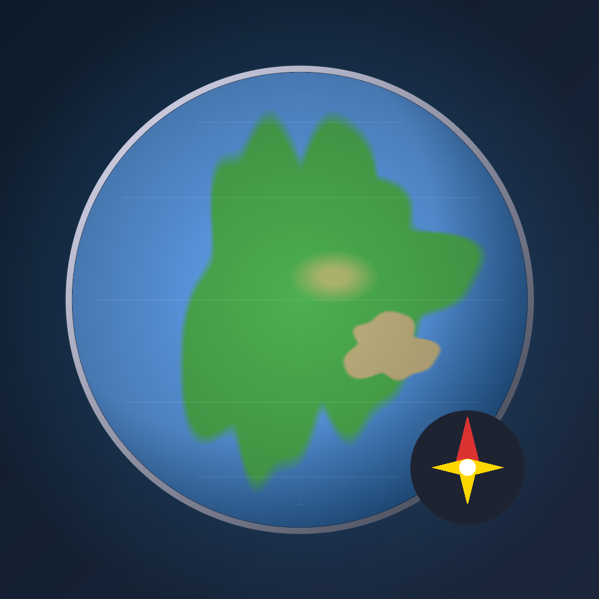

<div align="center">

# أطلس العالم | GeoMaster



### Master World Geography with AI-Powered Learning

[](https://flutter.dev)
[](https://dart.dev)
[](https://firebase.google.com)
[](LICENSE)
[](/)

**A world-class geography learning mobile app featuring AI tutoring, gamification, and full Arabic RTL support.**

[Download iOS](#) • [Download Android](#) • [Documentation](#architecture)

</div>

---

## Features

### Country Explorer
- Browse 195+ countries with detailed information
- Interactive maps with Google Maps integration
- Real-time weather data for capital cities
- High-quality country flags with SVG rendering
- Search and filter by region, population, and more

### Quiz Challenge Arena
- **5 Quiz Modes**: Capitals, Flags, Maps, Population, Currency
- **3 Difficulty Levels**: Easy, Medium, Hard
- Adaptive difficulty based on performance
- Timed challenges with streak bonuses
- Detailed results and performance analytics

### AI Tutor (Claude Integration)
- Personalized geography tutoring powered by Claude AI
- Context-aware responses based on learning progress
- Suggested prompts for guided learning
- Streaming responses for real-time interaction
- Chat history persistence

### Gamification System
- XP-based progression with level badges
- 50+ achievements to unlock
- Daily challenges and streak tracking
- Global and regional leaderboards
- Collectible rewards and milestones

### Full Arabic Support
- Complete RTL (Right-to-Left) layout support
- Native Arabic translations for all content
- Arabic-optimized typography (Cairo font)
- Localized country names and descriptions
- Seamless language switching

### Premium Features
- Ad-free experience
- Unlimited AI tutor conversations
- Exclusive quiz modes
- Priority leaderboard placement
- Early access to new features

---

## Architecture

GeoMaster follows **Clean Architecture** principles with a feature-based folder structure:

```
lib/
├── main.dart                    # Entry point
├── bootstrap.dart               # Firebase/services initialization
├── app.dart                     # MaterialApp.router configuration
│
├── app/
│   ├── di/service_locator.dart  # GetIt dependency injection
│   └── routes/app_router.dart   # GoRouter navigation
│
├── core/
│   ├── constants/               # Colors, dimensions, strings
│   ├── error/                   # Failure classes (Either pattern)
│   ├── extensions/              # Context, string extensions
│   ├── network/                 # Dio API client configuration
│   ├── theme/                   # Light/dark themes + RTL
│   └── utils/                   # Helpers, formatters
│
├── l10n/                        # Localization (ARB files)
│   ├── app_en.arb
│   └── app_ar.arb
│
├── data/
│   ├── datasources/
│   │   ├── local/               # Hive, SharedPreferences
│   │   └── remote/              # Firebase, REST APIs, Claude
│   ├── models/                  # Freezed DTOs
│   ├── repositories/            # Repository implementations
│   └── services/                # Analytics, RevenueCat, FCM
│
├── domain/
│   ├── entities/                # Pure business objects
│   ├── repositories/            # Repository interfaces
│   └── usecases/                # Business logic
│
├── presentation/
│   ├── providers/               # Riverpod state management
│   ├── widgets/                 # Shared UI components
│   └── navigation/              # Bottom nav, app bars
│
└── features/
    ├── onboarding/              # Language, auth, personalization
    ├── home/                    # Dashboard, daily challenges
    ├── country_explorer/        # List, map, country details
    ├── quiz/                    # Quiz modes, game, results
    ├── ai_tutor/                # Claude chat interface
    ├── gamification/            # XP, achievements, leaderboards
    ├── subscription/            # Paywall, premium tiers
    ├── settings/                # User preferences
    └── profile/                 # User stats, traveler passport
```

---

## Tech Stack

| Category | Technology |
|----------|------------|
| **Framework** | Flutter 3.10+ |
| **Language** | Dart 3.0+ |
| **State Management** | Riverpod 2.4+ with code generation |
| **Navigation** | GoRouter with auth guards |
| **Data Models** | Freezed for immutable DTOs |
| **Error Handling** | Either pattern (dartz) |
| **Dependency Injection** | GetIt + Riverpod |
| **Backend** | Firebase (Auth, Firestore, Analytics, Crashlytics) |
| **AI Integration** | Claude API with streaming |
| **Maps** | Google Maps Platform |
| **Monetization** | RevenueCat |
| **Local Storage** | Hive + SharedPreferences |
| **Networking** | Dio with interceptors |
| **Animations** | flutter_animate + Lottie |

---

## Getting Started

### Prerequisites

- Flutter SDK 3.10+
- Dart SDK 3.0+
- Xcode 14+ (for iOS)
- Android Studio / VS Code
- Firebase CLI
- CocoaPods (for iOS)

### Installation

1. **Clone the repository**
   ```bash
   git clone https://github.com/htirawi/geo_master.git
   cd geo_master
   ```

2. **Install dependencies**
   ```bash
   flutter pub get
   ```

3. **Configure Firebase**
   ```bash
   # Install FlutterFire CLI
   dart pub global activate flutterfire_cli

   # Configure Firebase (follow prompts)
   flutterfire configure
   ```

4. **Set up environment variables**
   ```bash
   cp .env.example .env
   # Edit .env with your API keys
   ```

5. **Generate code**
   ```bash
   dart run build_runner build --delete-conflicting-outputs
   ```

6. **Run the app**
   ```bash
   # iOS
   flutter run -d ios

   # Android
   flutter run -d android
   ```

### Environment Variables

Create a `.env` file in the project root:

```env
# Claude API
CLAUDE_API_KEY=your_claude_api_key

# Google Maps
GOOGLE_MAPS_API_KEY=your_google_maps_key

# RevenueCat
REVENUECAT_API_KEY_IOS=your_ios_key
REVENUECAT_API_KEY_ANDROID=your_android_key

# OpenWeatherMap
WEATHER_API_KEY=your_weather_api_key
```

---

## Testing

```bash
# Run unit tests
flutter test

# Run with coverage
flutter test --coverage

# Run integration tests
flutter test integration_test/

# Generate coverage report
genhtml coverage/lcov.info -o coverage/html
```

---

## Build & Release

### iOS
```bash
# Build for App Store
flutter build ios --release

# Build IPA
flutter build ipa --release
```

### Android
```bash
# Build APK
flutter build apk --release

# Build App Bundle (recommended for Play Store)
flutter build appbundle --release
```

---

## Firebase Functions

Deploy cloud functions for backend operations:

```bash
cd functions
npm install
firebase deploy --only functions
```

---

## Localization

GeoMaster supports English and Arabic. To add translations:

1. Edit `lib/l10n/app_en.arb` (English)
2. Edit `lib/l10n/app_ar.arb` (Arabic)
3. Run `flutter gen-l10n`

---

## Contributing

This is a proprietary project. Contributions are welcome from authorized team members only.

1. Create a feature branch (`git checkout -b feature/amazing-feature`)
2. Commit changes (`git commit -m 'Add amazing feature'`)
3. Push to branch (`git push origin feature/amazing-feature`)
4. Open a Pull Request

---

## License

This project is proprietary software. All rights reserved.

© 2024-2025 GeoMaster. Unauthorized copying, modification, or distribution is prohibited.

---

## Author

**Hussein Tirawi**
- GitHub: [@htirawi](https://github.com/htirawi)

---

<div align="center">

**Built with Flutter**

</div>
